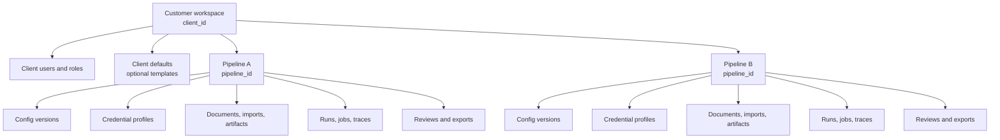

# Multi-Pipeline Plan

Acceptance Criteria:
- Define independent pipelines under a single customer workspace.
- Ensure each pipeline can have separate datasets, configuration, run history, sources, tools, credentials, targets, budgets, and outputs.
- Define a robust per-pipeline credential and configuration model with health, expiry, validation, rotation, audit, and redaction behavior.
- Bind pipeline scope to the existing roadmap phases without delaying the current Phase 01 foundation.
- Define UI, API, contract, data, testing, and observability requirements for pipeline isolation.

## Purpose

A customer may need many independent lead-intelligence pipelines. For example, the same customer may run:

- A chemical industry discovery pipeline.
- An oil and gas seed-lead enrichment pipeline.
- A Latin America expansion pipeline with separate sources and credentials.
- A trade-show follow-up pipeline with a limited dataset and short campaign window.
- A sandbox pipeline for testing new source/provider adapters.

These pipelines must not bleed data, configuration, credentials, run history, scores, review decisions, or exports into each other. The system should make this independence obvious in the admin/developer UI.

## Core Requirement

Every customer workspace can contain multiple pipelines. A pipeline is the operational boundary for:

- Dataset inputs.
- Active ICP and guardrail configuration.
- Source and provider configuration.
- Credential profiles and secret references.
- Crawl/search/enrichment/verification/outreach tool usage.
- Run history, job history, logs, traces, metrics, and audit.
- Extracted entities, evidence, embeddings, review decisions, lead candidates, and exports.
- Cost, quota, budgets, schedules, and release readiness.

Client-level records are only defaults, users, billing/compliance shell, and optional templates. Pipeline-owned records must include both `client_id` and `pipeline_id`.

## Scope Model



## Pipeline Independence Rules

| Rule | Requirement |
|---|---|
| Data isolation | Documents, seed imports, artifacts, embeddings, extracted records, leads, reviews, and exports are scoped to one `pipeline_id`. |
| Run isolation | `pipeline_runs`, `job_runs`, outbox/inbox events, traces, metrics, logs, and retries include `pipeline_id`. |
| Config isolation | Active ICP, guardrails, source policy, scoring weights, source registry, provider settings, and export rules are pipeline-specific. |
| Credential isolation | Credentials belong to one pipeline unless an admin explicitly copies or re-authorizes them for another pipeline. |
| Retrieval isolation | Vector queries must filter by `client_id` and `pipeline_id`; cross-pipeline retrieval is blocked by default. |
| Export isolation | Export batches can include leads from one pipeline only unless a later enterprise feature explicitly creates a governed combined export. |
| Audit isolation | Audit entries include `pipeline_id` when the action affects pipeline-owned data or config. |
| Copy behavior | A pipeline may be cloned from another pipeline, but clone creates new config versions, credential references, schedules, and run history. |

## Configuration Model

Use a layered model that keeps customer defaults convenient but pipeline execution deterministic.

| Layer | Purpose | Mutability |
|---|---|---|
| Client defaults | Optional default export settings, retention policy, allowed lanes, and compliance defaults. | Editable by admin. |
| Pipeline settings | Pipeline name, objective, enabled lane, target market, geography, target titles, budgets, schedules, and data retention override. | Editable by admin/domain expert based on permission. |
| Pipeline config version | Immutable snapshot of ICP, guardrails, source policy, scoring weights, prompt/model/schema versions, and export rules. | Created on approval; never mutated. |
| Run config snapshot | Exact config version and credential/profile versions used for one run. | Immutable once run starts. |

Required tables starting in Phase 01:

| Table | Purpose |
|---|---|
| `pipelines` | One pipeline under a client workspace, with name, status, objective, enabled lane, owner, and lifecycle timestamps. |
| `pipeline_settings` | Typed settings records for target, schedule, budget, data policy, default export behavior, and feature toggles. |
| `pipeline_config_versions` | Immutable approved config snapshots, with active/draft/superseded state and audit metadata. |

Configuration rules:

- Pipeline runs always reference a `pipeline_config_version_id`.
- Config changes create drafts and then new approved versions.
- Previous runs remain tied to the exact config version they used.
- Client defaults may prefill a pipeline, but never silently change an active pipeline config.
- A pipeline cannot start a run if required config, policy, or credentials are missing or unhealthy.

## Credential And Key Management Model

Credentials must be pipeline-scoped, secret-safe, and visible through health status without exposing raw values.

### Storage Boundary

The database stores credential metadata and vault references only. Raw secrets never live in normal application tables, logs, traces, artifacts, prompts, screenshots, or frontend state.

| Component | Responsibility |
|---|---|
| `credential_profiles` | Pipeline-scoped metadata: adapter, operation scopes, auth strategy, owner, status, expiry, validation timestamps, and secret reference IDs. |
| Secret adapter | Reads/writes encrypted secrets through the configured vault or local encrypted development store. |
| `credential_validation_runs` | Records validation attempts, result, error class, expiry detected, scopes verified, and next check time. |
| `credential_rotation_events` | Records rotation, revocation, reauthorization, and emergency disable actions. |
| Auth session tables | Store encrypted browser/session metadata for authenticated workflows in Phase 08, tied to `pipeline_id` and `credential_profile_id`. |

### Credential Statuses

| Status | Meaning | UI Treatment |
|---|---|---|
| `draft` | Metadata exists but secret is not stored or validated. | Cannot run; show setup action. |
| `active` | Secret is present, valid, and scoped for required operations. | Ready. |
| `expiring_soon` | Expiry is within the configured warning window. | Warn and show rotate action. |
| `expired` | Key, token, certificate, or session is expired. | Block dependent operations. |
| `validation_failed` | Last validation failed for auth, scope, network, or provider reason. | Block or require review based on policy. |
| `insufficient_scope` | Credential works but lacks required operation scope. | Block broadened operation. |
| `rotation_due` | Credential is still usable but past rotation policy. | Warn or block based on pipeline policy. |
| `revoked` | Admin or provider revoked it. | Block all operations. |
| `disabled` | Temporarily disabled by policy or admin. | Block all operations. |

### Credential Metadata

Each credential profile should include:

- `client_id`.
- `pipeline_id`.
- `credential_profile_id`.
- `display_name`.
- `adapter_key`.
- `operation_scopes`, such as `crawl`, `search`, `browser_render`, `contact_enrich`, `email_verify`, `crm_export`, `outreach_export`.
- `auth_strategy`, such as API key, OAuth, service account, username/password, browser session, webhook signing secret.
- `secret_ref`, `secret_version`, and non-sensitive fingerprint.
- `expires_at`, `rotation_due_at`, `last_validated_at`, `next_validation_at`.
- `status`, `status_reason`, `last_error_code`.
- `terms_reference`, `credential_scope`, `pii_classification`.
- `created_by`, `updated_by`, `approved_by`, and audit timestamps.

### Validation And Expiry Handling

- Credentials are validated before first use.
- Credentials are revalidated on a schedule and before high-risk operations.
- Expiring credentials create notifications and dashboard warnings.
- Expired or invalid credentials block dependent runs before any provider call.
- Validation failures classify as `auth_failed`, `expired`, `insufficient_scope`, `provider_unavailable`, `rate_limited`, `terms_blocked`, or `unknown`.
- Validation jobs must not print raw secrets or provider responses containing secrets.
- Credential health is shown in the pipeline config area and in run preflight checks.

## API Plan

Pipeline APIs begin in Phase 01.

```text
GET    /clients/{client_id}/pipelines
POST   /clients/{client_id}/pipelines
GET    /clients/{client_id}/pipelines/{pipeline_id}
PATCH  /clients/{client_id}/pipelines/{pipeline_id}
GET    /clients/{client_id}/pipelines/{pipeline_id}/settings
PATCH  /clients/{client_id}/pipelines/{pipeline_id}/settings
GET    /clients/{client_id}/pipelines/{pipeline_id}/config-versions
POST   /clients/{client_id}/pipelines/{pipeline_id}/config-versions
POST   /clients/{client_id}/pipelines/{pipeline_id}/clone
```

Credential APIs begin with mock/metadata support in Phase 04 and expand for authenticated session state in Phase 08.

```text
GET    /clients/{client_id}/pipelines/{pipeline_id}/credentials
POST   /clients/{client_id}/pipelines/{pipeline_id}/credentials
GET    /clients/{client_id}/pipelines/{pipeline_id}/credentials/{credential_profile_id}
PATCH  /clients/{client_id}/pipelines/{pipeline_id}/credentials/{credential_profile_id}
POST   /clients/{client_id}/pipelines/{pipeline_id}/credentials/{credential_profile_id}/secret
POST   /clients/{client_id}/pipelines/{pipeline_id}/credentials/{credential_profile_id}/validate
POST   /clients/{client_id}/pipelines/{pipeline_id}/credentials/{credential_profile_id}/rotate
POST   /clients/{client_id}/pipelines/{pipeline_id}/credentials/{credential_profile_id}/revoke
```

Route rule:

- Pipeline-owned APIs use `/clients/{client_id}/pipelines/{pipeline_id}/...`.
- Client-level APIs stay under `/clients/{client_id}/...`.
- Admin cross-pipeline views require explicit filters for `client_id` and `pipeline_id`.

## Frontend Plan

The admin/developer UI must make the active pipeline obvious.

| Area | Requirement |
|---|---|
| Pipeline switcher | Show current customer and current pipeline in the app shell. Switching pipelines changes visible data, config, runs, and credentials. |
| Pipeline list | Show pipeline status, lane, target, last run, next scheduled run, credential health, blockers, and owner. |
| Pipeline setup | Create pipeline from blank form, client defaults, or clone of another pipeline. |
| Pipeline config | Show target, data needs, source policy, provider policy, budgets, schedules, scoring weights, and active config version. |
| Credential area | Show per-pipeline credentials, scopes, expiry, validation status, last validation error, next validation, rotation due, and dependent operations. |
| Run preflight | Show missing config, expired keys, invalid scopes, source blocks, budget stops, and required approvals before starting a run. |
| Evidence pages | Always show pipeline context and prevent accidental mixed-pipeline views. |

Credential UI should never show raw secret values. It may show safe metadata such as provider, auth type, scopes, expiry, last validation, masked fingerprint, and status reason.

## Phase Integration

| Phase | Pipeline Work |
|---:|---|
| 01 | Add `pipelines`, `pipeline_settings`, `pipeline_config_versions`, pipeline CRUD APIs, pipeline UI routes, pipeline switcher, and isolation tests. |
| 02 | Attach documents, document chunks, lead import batches, seed rows, embeddings, `pipeline_runs`, `job_runs`, outbox, and inbox records to `pipeline_id`. |
| 03 | Make ICP, guardrails, suppression, title mappings, review queues, and config approvals pipeline-specific. |
| 04 | Make sources, providers, policy decisions, URL/profile candidates, credential profiles, operation scopes, and credential health pipeline-specific. |
| 05 | Make crawl/search plans, jobs, artifacts, budgets, failures, and artifact inspection pipeline-specific. |
| 06 | Make classifications, extraction, profile matching, provider enrichment, email verification, vector retrieval, and storage pipeline-specific. |
| 07 | Make lead candidates, score breakdowns, review decisions, export simulation, CRM export, and outreach export pipeline-specific. |
| 08 | Make authenticated sessions, MFA/CAPTCHA recovery, encrypted browser state, and auth resume controls pipeline-specific. |
| 09 | Add cross-pipeline admin dashboards with explicit filters, credential expiry alerts, queue health by pipeline, and trace/audit views by pipeline. |
| 10 | Keep v2 hypotheses, strategy modes, expected value, temporal signals, and attention queues pipeline-specific by default. |
| 11 | Support enterprise cross-pipeline comparison, provider quality analytics, CRM/outreach mappings, and governed combined outcome dashboards. |

## Roadmap Plug-In

The current roadmap should treat pipeline support as a foundation requirement, not a later feature.

| Roadmap Area | Change |
|---|---|
| Developer Alpha | Must prove one client can have at least two independent pipelines. |
| Ingestion MVP | Must upload different documents and seed lead sheets into different pipelines without data leakage. |
| Discovery MVP | Must configure different sources, providers, policies, and credentials per pipeline. |
| Lead MVP | Must review and export leads from one pipeline without including another pipeline's data. |
| Production v1 | Must show run, trace, audit, cost, quota, and credential health by pipeline. |
| Enterprise v3 | May add cross-pipeline analytics and governed combined exports, but defaults remain isolated. |

## Required Tests

Every phase that creates pipeline-owned data must include isolation tests.

Minimum Phase 01 test:

- Create one client.
- Create two pipelines under that client.
- Give each pipeline different settings.
- Fetch each pipeline and verify settings do not bleed.
- Verify deleting or disabling one pipeline does not affect the other.

Minimum Phase 02 test:

- Upload one document and one seed lead sheet into Pipeline A.
- Upload different inputs into Pipeline B.
- Verify document lists, chunks, import rows, embeddings, run ledgers, and evidence views are isolated.

Minimum Phase 04 credential test:

- Create two pipelines under one client.
- Add a mock provider credential to Pipeline A only.
- Verify Pipeline B cannot use Pipeline A credential.
- Mark Pipeline A credential expired.
- Verify Pipeline A run preflight blocks dependent operations and Pipeline B remains unaffected.

Minimum production hardening test:

- Run both pipelines.
- Verify logs, traces, metrics, audit records, cost, quota, and credential health can be filtered by `client_id` and `pipeline_id`.

## Migration Note

The project is currently in Phase 01 and has not implemented the persistent data model yet. Adopt `pipeline_id` now in the foundation rather than adding a later migration that backfills pipeline ownership.

