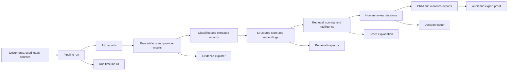

# Testable Blueprint

Acceptance Criteria:
- Define a phase-by-phase testability overlay for the AI Lead Intelligence Pipeline.
- Make every completed phase testable through an admin/developer UI without requiring direct database or API inspection.
- Preserve traceability from input files, pages, provider results, LLM calls, review decisions, embeddings, retrieval, scoring, credentials, pipeline scope, and exports.
- Keep diagnostics summarized by default with drill-down evidence available on demand.
- Bind UI routes, evidence records, contracts, and exit gates to the roadmap phases in `00-roadmap.md`.

## Purpose

This document turns the blueprint into a transparent, end-to-end testable system. Each phase must produce a usable product increment plus a diagnostic surface that proves what happened, why it happened, what data was created, and what was blocked.

The goal is not to expose every raw event at once. The goal is to give an admin or developer a calm operations console where each flow has:

- A run summary.
- A stage timeline.
- Evidence counts and quality gates.
- Selected/rejected reasons.
- Links to raw artifacts and extracted objects.
- Embedding, retrieval, scoring, review, and export proof.
- Errors, retries, policy blocks, and next actions.

## Current Phase Alignment

| Field | Value |
|---|---|
| Source roadmap | `docs/blueprint/00-roadmap.md` |
| Current phase | Phase 01: Data Foundation And Workspace API |
| Last completed phase | Phase 00: Project Foundation |
| Testability rule | No phase is complete until its main workflow can be observed from the UI or from a documented developer diagnostic route, scoped by customer and pipeline where applicable. |

## Diagnostic Product Principle

Every pipeline object should be explainable through four questions:

| Question | UI Answer |
|---|---|
| What happened? | Run timeline, job state, event list, artifact counts, and status badges. |
| What data was produced? | Typed records, previews, extracted fields, normalized values, embeddings, scores, and exports. |
| Why was it accepted or rejected? | Policy decisions, validation errors, confidence, reviewer decision, schema errors, suppression hits, and score breakdowns. |
| Can I trust it? | Source evidence, citations, lineage IDs, prompt/model/schema versions, trace IDs, and audit history. |

## Operations Console Model

Add a diagnostics layer to the React admin/developer experience. It should reuse the normal product pages from `frontend.md`, with a small set of cross-cutting diagnostic views.

| Surface | Route | First Phase | Purpose |
|---|---|---:|---|
| System status | `/system/status` | 00 | Show API reachability, build metadata, dependency health, and environment mode. |
| Workspace overview | `/clients/:clientId/overview` | 01 | Show pipelines, enabled lanes, recent runs, pending actions, and data completeness. |
| Pipeline overview | `/clients/:clientId/pipelines/:pipelineId` | 01 | Show objective, target, config version, data completeness, credential health, blockers, and last run. |
| Run ledger | `/clients/:clientId/pipelines/:pipelineId/runs` | 02 | List runs across documents, imports, crawl, extraction, review, and export for one pipeline. |
| Run detail | `/clients/:clientId/pipelines/:pipelineId/runs/:runId` | 02 | Show stage timeline, jobs, events, artifacts, records created, failures, and retries. |
| Evidence explorer | `/clients/:clientId/pipelines/:pipelineId/evidence` | 02 | Search documents, pages, seed rows, crawl artifacts, provider results, citations, and extracted facts. |
| Artifact inspector | `/clients/:clientId/pipelines/:pipelineId/artifacts/:artifactId` | 05 | Show raw artifact metadata, safe preview, extraction results, policy decision, and lineage. |
| Decision ledger | `/clients/:clientId/pipelines/:pipelineId/decisions` | 03 | Show approvals, rejections, policy decisions, suppressions, and export blockers. |
| Embedding and retrieval inspector | `/clients/:clientId/pipelines/:pipelineId/retrieval` | 02 | Show chunk counts, embedding status, query tests, retrieved chunks, and retrieval metrics. |
| Credential health | `/clients/:clientId/pipelines/:pipelineId/credentials` | 04 | Show credential status, expiry, validation, rotation, scopes, dependent operations, and blockers without raw secrets. |
| Worker operations | `/admin/runs` | 09 | Show queues, leases, heartbeats, retries, dead letters, budgets, and trace links. |
| Audit and trace explorer | `/admin/audit` | 09 | Show actor, event, entity, before/after diff, trace ID, and compliance context. |

Default pages should show summary counts and only the most important blockers. Drill-down panels should reveal raw data, JSON contracts, trace IDs, prompt metadata, and event payloads when a developer needs them.

## End-To-End Evidence Flow

## Minimal Diagnostic Contracts

These are conceptual contracts. Implement them as typed backend contracts in `src/backend/core/contracts` and typed frontend contracts in `src/frontend/web/src/contracts` when each phase begins.

| Contract | First Phase | Required Fields |
|---|---:|---|
| `PipelineRunSummary` | 02 | `run_id`, `client_id`, `pipeline_id`, `pipeline_config_version_id`, `run_type`, `status`, `started_at`, `finished_at`, `created_counts`, `blocked_counts`, `error_count`, `trace_id` |
| `RunStageSummary` | 02 | `stage_key`, `status`, `job_count`, `record_count`, `blocked_count`, `duration_ms`, `latest_error`, `next_action` |
| `JobDiagnostic` | 02 | `job_id`, `queue`, `job_type`, `status`, `attempt`, `retry_class`, `heartbeat_at`, `idempotency_key`, `trace_id`, `error_code` |
| `EvidenceRecordSummary` | 02 | `evidence_id`, `source_type`, `source_label`, `lineage_id`, `confidence`, `policy_status`, `preview`, `created_at` |
| `ArtifactDiagnostic` | 05 | `artifact_id`, `source_id`, `url`, `content_type`, `fetch_status`, `downloaded_bytes`, `checksum`, `policy_decision_id`, `safe_preview_available` |
| `ExtractionDiagnostic` | 06 | `extraction_id`, `artifact_id`, `schema_name`, `schema_version`, `status`, `field_count`, `evidence_count`, `rejection_reason` |
| `EmbeddingDiagnostic` | 02 | `chunk_id`, `source_id`, `embedding_model`, `embedding_version`, `vector_status`, `metadata`, `dedupe_key` |
| `RetrievalDiagnostic` | 02 | `query`, `filters`, `top_k`, `retrieved_chunk_ids`, `scores`, `empty_result_reason`, `latency_ms` |
| `PolicyDecisionDiagnostic` | 04 | `policy_decision_id`, `operation_type`, `decision`, `reason`, `source_terms`, `credential_scope`, `rate_limit_key` |
| `CredentialHealthDiagnostic` | 04 | `credential_profile_id`, `client_id`, `pipeline_id`, `adapter_key`, `operation_scopes`, `status`, `expires_at`, `rotation_due_at`, `last_validated_at`, `next_validation_at`, `status_reason`, `dependent_operations` |
| `ReviewDecisionDiagnostic` | 03 | `review_item_id`, `entity_type`, `decision`, `actor_id`, `reason`, `evidence_ids`, `created_at` |
| `ExportDiagnostic` | 07 | `export_id`, `status`, `approved_count`, `blocked_count`, `simulation_result`, `reviewer_id`, `download_artifact_id` |

## Phase Binding

### Phase 00: Project Foundation

Diagnostic outcome: prove the service is reachable and the development workflow is healthy.

| Must Be Visible | UI Surface | Evidence |
|---|---|---|
| API health | `/system/status` or `/health` | Status, app name, version or build marker, environment mode. |
| Developer commands | README and status page link | `make -f devops/Makefile test` and `make -f devops/Makefile lint` pass. |

Exit gate addition:

- Phase 00 is testable when a developer can open the health/status route and see that the local API is alive.

### Phase 01: Data Foundation And Workspace API

Diagnostic outcome: prove tenant workspaces, independent pipelines, settings, enabled lanes, and admin UI contracts work.

| Must Be Visible | UI Surface | Evidence |
|---|---|---|
| Client create/list/update flow | `/clients`, `/clients/new`, `/clients/:clientId/settings` | Created client, updated settings, enabled lanes, timestamps, validation errors. |
| Pipeline create/list/update flow | `/clients/:clientId/pipelines`, `/clients/:clientId/pipelines/new`, `/clients/:clientId/pipelines/:pipelineId/settings` | Created pipelines, independent settings, objective, lane, target, schedule, budget, timestamps, validation errors. |
| Workspace data completeness | `/clients/:clientId/overview` | Pipeline list, enabled discovery/enrichment lanes, export defaults, guardrail placeholders, user placeholder. |
| API boundary behavior | Page error states | Loading, empty, validation, server error, and permission-denied states. |

Exit gate addition:

- Phase 01 is testable when an admin can create a sample client, create at least two pipelines, give them different settings, refresh the page, and see persisted isolated values without using the API console.

### Phase 02: Document And Seed Lead Ingestion

Diagnostic outcome: prove uploaded files become retained source records, parsed content, chunks, embeddings, ICP suggestions, and normalized seed rows.

| Must Be Visible | UI Surface | Evidence |
|---|---|---|
| Document upload and parse | Document detail and run detail | Original file metadata, page count, parser status, text preview, parser errors. |
| Chunking and embeddings | Retrieval inspector | Chunk count, chunk metadata, embedding model/version, vector status, dedupe keys. |
| Extracted knowledge | Knowledge page and Evidence Rail | Suggested ICP facts, confidence, citations, source page/snippet. |
| Seed lead normalization | Lead import batch detail | Original values, normalized values, row errors, duplicates, suppression indicators. |
| Async workflow proof | Run detail | `pipeline_runs`, `job_runs`, outbox/inbox event status, retries, idempotency keys. |

Exit gate addition:

- Phase 02 is testable when a developer can upload the tec5USA questionnaire and a seed lead sheet, then inspect every generated page, chunk, embedding, suggestion, row validation, and retryable failure from the UI.

### Phase 03: Expert Config Review

Diagnostic outcome: prove human decisions control what becomes active configuration.

| Must Be Visible | UI Surface | Evidence |
|---|---|---|
| Suggested config review | `/clients/:clientId/review/config` | Suggestion, source evidence, confidence, edit diff, approve/reject controls. |
| Active config state | Config pages | Active ICP, title mappings, suppression rules, enrichment guardrails, outreach guardrails. |
| Decision history | Decision ledger | Actor, timestamp, decision, reason, before/after diff, evidence links. |
| Permission behavior | Permission-denied states | Missing role, blocked action, safe navigation path. |

Exit gate addition:

- Phase 03 is testable when an expert can approve, edit, and reject suggestions, and the UI shows exactly which approved values became active and which rejected values were excluded.

### Phase 04: Source Registry And Policy

Diagnostic outcome: prove every source, provider, credential scope, and operation is policy-routed before execution.

| Must Be Visible | UI Surface | Evidence |
|---|---|---|
| Source/provider configuration | Sources and providers pages | Pipeline-scoped connector type, operation scopes, credentials metadata, rate limits, terms reference. |
| Credential health | Credential health panel | Status, expiry, validation result, rotation due, scope, masked fingerprint, dependent operations, blocker reason. |
| Policy simulation | Policy simulator | Allow/block/review decision, reason, credential scope, PII class, cost estimate. |
| Candidate routing | URL/profile candidate views | Candidate URL/profile, source, policy decision, route target, block reason. |
| Adapter certification | Connector test results | Mock provider result, contract validation, healthcheck, failure classification. |

Exit gate addition:

- Phase 04 is testable when an admin can configure a mock source/provider and credential for one pipeline, run policy simulation, and see why each candidate operation is allowed, blocked, sent to review, or blocked by missing/expired credentials.

### Phase 05: Public Crawl And Raw Artifacts

Diagnostic outcome: prove planned public collection creates inspectable crawl/search jobs and raw artifacts without losing policy lineage.

| Must Be Visible | UI Surface | Evidence |
|---|---|---|
| Crawl/search plan | Run detail | Sources selected, queries generated, candidate URLs, budgets, expected job count. |
| Pages scanned | Crawl monitor | URL, status, fetch time, bytes, content type, policy decision, retry status. |
| Downloads/artifacts | Artifact inspector | Stored artifact metadata, checksum, safe preview, snapshot link, extraction readiness. |
| Blocked and failed work | Failure summary | Policy blocks, rate limits, robots/terms blocks, network errors, retry class. |

Exit gate addition:

- Phase 05 is testable when a developer can run a small public crawl and see every URL scanned, every artifact downloaded, every block/failure reason, and every artifact handed to classification.

### Phase 06: Classification, Extraction, And Enrichment

Diagnostic outcome: prove artifacts and seed rows become structured, evidence-backed companies, signals, contacts, profile matches, provider results, and email verifications.

| Must Be Visible | UI Surface | Evidence |
|---|---|---|
| Page classification | Extractions page | Page type, relevance score, reason, classifier version, evidence snippet. |
| Entity extraction | Artifact inspector and extraction detail | Extracted companies, signals, contacts, schema version, validation status. |
| Selected/rejected extraction | Extraction detail | Accepted fields, rejected fields, reason, confidence, source citation. |
| Profile matching | Profile candidate comparison | Candidate profiles/domains, rank reasons, source policy, reviewer-needed flags. |
| Provider enrichment | Enrichment monitor | Provider request status, cost/quota, returned fields, licensed source, errors. |
| Email verification | Email verification page | Verification status, suppression status, deliverability reason, export blocker. |
| Embedding/retrieval usage | Retrieval inspector | Which chunks/artifacts were retrieved to support extraction or analysis. |

Exit gate addition:

- Phase 06 is testable when a reviewer can select one artifact or seed row and follow it through classification, extraction, profile/domain matching, enrichment, verification, acceptance/rejection, and storage.

### Phase 07: Lead Review And Export

Diagnostic outcome: prove only evidence-backed, reviewed, compliant leads are exported.

| Must Be Visible | UI Surface | Evidence |
|---|---|---|
| Lead candidate creation | Lead review queue | Company, contact, score, fit reasons, evidence count, blockers. |
| Score explanation | Lead detail | Score components, confidence, source evidence, exclusion warnings. |
| Human review | Decision ledger and lead detail | Approve/reject/edit/manual-follow-up decision, actor, reason, timestamp. |
| Export simulation | Export builder | Approved rows, blocked rows, blocker reasons, suppression and policy checks. |
| Export proof | Export detail | File metadata, row count, reviewer, audit event, export artifact. |

Exit gate addition:

- Phase 07 is testable when a full MVP run creates lead candidates, a reviewer approves selected leads, export simulation explains blocked rows, and the generated export links back to evidence and review decisions.

### Phase 08: Authenticated Crawl And HITL

Diagnostic outcome: prove authenticated source work is scoped, secret-safe, pausable, resumable, and human-recoverable.

| Must Be Visible | UI Surface | Evidence |
|---|---|---|
| Auth session state | Auth sessions dashboard | Valid, expired, challenged, revoked, paused, resumed states. |
| Human auth challenge | Auth recovery page | Source, original job, challenge reason, allowed action, secure handoff status. |
| Resume behavior | Run detail | Paused job, checkpoint, resume event, original policy decision, retry state. |
| Secret safety | Auth UI and audit | Redacted credential metadata only; no raw token, cookie, password, or storage state. |

Exit gate addition:

- Phase 08 is testable when a mocked authenticated source pauses for MFA/CAPTCHA, an approved operator refreshes the session, and the original job resumes without exposing secrets.

### Phase 09: Production Hardening

Diagnostic outcome: prove production runs are observable, auditable, secure, and diagnosable across services.

| Must Be Visible | UI Surface | Evidence |
|---|---|---|
| Distributed tracing | Admin run detail and trace links | Trace across API, worker, crawler/provider, LLM, review, export. |
| Worker operations | `/admin/runs` | Queue age, leases, heartbeats, retries, dead letters, concurrency, budget stops. |
| Audit logs | `/admin/audit` | Actor, entity, action, before/after diff, trace ID, redaction status. |
| Cost and quality metrics | `/admin/metrics` | LLM cost, provider quota, verification pass rate, enrichment quality, bounce rate. |
| Release evidence | Production checklist | SBOM/provenance, image scan, signed or attested images, runbooks, CI gates. |

Exit gate addition:

- Phase 09 is testable when an admin can trace one sample lead from initial request through every worker, provider/LLM call, review decision, export, and audit record.

### Phase 10: v2 Intelligence Layer

Diagnostic outcome: prove advanced intelligence changes priorities with explainable, feature-flagged evidence instead of opaque scores.

| Must Be Visible | UI Surface | Evidence |
|---|---|---|
| Hypothesis generation | Hypotheses page | Hypothesis, supporting evidence, expected value, status, feature flag. |
| Dataset selection | Attention queue and retrieval inspector | Which datasets/chunks/signals were used, filters, ranking reason, empty-result reason. |
| Economic prioritization | Strategy and attention pages | Expected value, cost, budget cap, work deferred by policy. |
| Temporal/authenticity/skeptic effects | Intelligence detail | Score before/after, signal momentum, trust score, counterevidence, counterfactual explanation. |

Exit gate addition:

- Phase 10 is testable when a developer can compare pre-v2 and post-v2 rankings, inspect which datasets were selected for analysis, and see why work was prioritized, paused, or downranked.

### Phase 11: Enterprise Scale And Integrations

Diagnostic outcome: prove CRM/outreach integrations, outcomes, provider quality, and tenant scale controls are measurable and reversible.

| Must Be Visible | UI Surface | Evidence |
|---|---|---|
| CRM/outreach mappings | Integration editors | Field mappings, sandbox test, diff, rollback state, secret-safe metadata. |
| Outcome ingestion | Outcome dashboard | Sent, bounced, opened, replied, meeting, opportunity, win/loss events attached to leads. |
| Learning loop | Provider quality and strategy pages | Proposed scoring/provider weight changes, approval state, before/after impact. |
| Tenant scale | Enterprise dashboard | Tenant filters, source/provider quality, cost, quota, saved views, isolation errors. |

Exit gate addition:

- Phase 11 is testable when a sandbox CRM/outreach loop exports reviewed leads, imports outcomes, updates suppression or quality signals, and shows the full feedback lineage per tenant.

## Full-Flow Test Scripts By Release

| Release | Flow To Prove | Required Evidence |
|---|---|---|
| Developer Alpha | Create client workspace and two pipelines | Client persisted, two pipeline settings persisted independently, UI states tested. |
| Ingestion MVP | Upload document and seed lead file | Pages parsed, chunks embedded, suggestions cited, seed rows normalized, run ledger populated. |
| Discovery MVP | Configure source and collect public artifacts | Policy decisions, URL candidates, crawl jobs, artifacts, failures, and downloaded evidence visible. |
| Lead MVP | Produce reviewed export | Extraction, enrichment, verification, score, review, export simulation, and export artifact linked. |
| Production v1 | Trace production-like run | Trace, metrics, audit, queue health, cost, redaction, and release gates visible. |
| Intelligence v2 | Explain priority change | Dataset selection, hypothesis, cost/value, skeptic, authenticity, and attention ranking visible. |
| Enterprise v3 | Close outcome loop | CRM/outreach mapping, outbound export, inbound outcomes, provider quality, tenant-safe dashboards visible. |

## Evidence Density Rules

To avoid overwhelming the operator:

- Show summaries first: counts, statuses, blockers, next action.
- Use progressive disclosure for raw payloads, JSON, prompt metadata, and trace spans.
- Provide filters for status, source, run type, entity type, reviewer, and time range.
- Use saved column presets for developer, reviewer, compliance, and sales views.
- Cap default timelines to important state transitions, with an option to show all events.
- Group duplicate errors by error code and source instead of listing every repeated failure.
- Always show plain-language blocker reasons beside machine codes.

## Required Test Data

Each phase should maintain deterministic fixtures that let developers reproduce the flow locally.

| Fixture | First Phase | Purpose |
|---|---:|---|
| `tec5usa_questionnaire` | 02 | Document parsing, chunking, embedding, ICP suggestion, citation checks. |
| `seed_lead_sheet_basic` | 02 | Column mapping, required field validation, normalization, duplicate and suppression checks. |
| `mock_public_source_small` | 04 | Policy simulation and deterministic URL candidate planning. |
| `mock_crawl_artifacts_small` | 05 | Crawl artifact storage, classification, extraction, retry, and failure UI. |
| `mock_provider_enrichment` | 06 | Licensed provider result, quota/cost, contact enrichment, email verification. |
| `review_export_happy_path` | 07 | Review approval, export simulation, export artifact, audit proof. |
| `mock_auth_portal` | 08 | Auth pause, manual recovery, resume, secret redaction. |
| `production_trace_sample` | 09 | Trace, metrics, audit, LLM cost, queue dashboard verification. |
| `v2_priority_sample` | 10 | Dataset selection, hypothesis, cost/value, skeptic, and authenticity explanation. |
| `sandbox_outcome_sample` | 11 | CRM/outreach outcome ingestion and learning loop review. |

## Definition Of Done Addition

For every phase after Phase 00, add these checks to the phase exit criteria:

- A representative happy path is executable from the UI.
- A representative failure path is visible from the UI with a clear reason and next action.
- Run, job, event, evidence, and audit identifiers can be copied from the UI for developer support.
- Every created business object links back to source evidence or a clearly recorded manual decision.
- Every pipeline-owned business object shows its owning `client_id` and `pipeline_id` in developer diagnostics.
- Typed API and frontend contracts cover the diagnostic payloads introduced in that phase.
- Tests cover loading, empty, success, failure, permission, retry, and long-content states for diagnostic surfaces.
